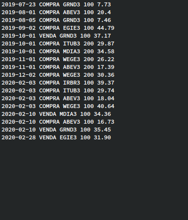
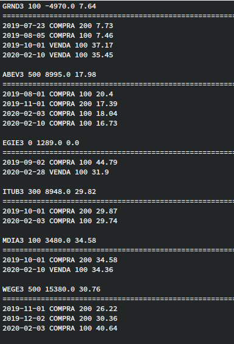

# Assets

Assets is a simple application which goal is controlling and analyses of investiments in assets.

**You can transform these raw records below...**

<div style="display: flex;">
   
</div>

**In this simple but summary report!**

<div style="display: flex; height=300px">
   
</div>

**And even more, the data may be filtered!**

First of all!!

Since the project is still under development, you need to follow these steps on the linux command line:

Clone the project

```console
> git clone https://github.com/dirceuBarquette/Assets.git
``` 
Move to Assets directory root

```console
> cd Assets/
```

Build and run the project

```console
> stack run
```

**Note**: If you don't have `stack` installed yet, go to [install/upgrade - The Haskell Tool Stack](https://docs.haskellstack.org/en/stable/install_and_upgrade/) and follow the instructions to install it.

Then you will see the first screen

```console
1 - Importar
2 - Filtrar
3 - Sumarizar
0 - Sair
digite uma opção > 
```

The first need is to import the raw data from your file system, so you will press **1** to do this.

```console
1 - Importar
0 - Voltar
digite uma opção >
```

**Note**: raw data must be formatted in five fields separated by blanks. Each individual field must follow these rules below:

```console
2019-11-01 COMPRA WEGE3 200 26.22
```

 When you press **1 ** again at the last prompt, you will be asked to import the file. So just type in the full file path! For example, there is an appropriate file that you can get ...

```console
test/examples/few_records.txt
```

...and paste it into the next prompt

```console
nome do arquivo para importar > test/examples/few_records.txt
```

Then the app will show you everything is fine by displaying a message like this

```console
o arquivo imported-2021-05-04.165816.flt está disponível para filtragem
```

From now on, this file will be ready to be filtered as you wish. So your best choice is to type **2** to make it interesting

```console
1 - Importar
2 - Filtrar
3 - Sumarizar
0 - Sair
digite uma opção > 2
```
and then the option **1** again to select a file

```console
1 - Selecionar arquivo
0 - Voltar
digite uma opção > 1
```
So, the next display will be

```console
1 - imported-2021-05-04.165816.flt
0 - Voltar
digite uma opção >
```
And your choice **1** to select the file

You can now choose between three types of filtering:

+ by ticker (or tickers separated by a space)
+ by date (or a range of dates separated by a space)
+ by type of operation (COMPRA or VENDA)

Say you want only tickers filtered by WEGE3 and ABEV3, you can first

```console
1 - Filtrar por ticker(s). Ex.: ABCD3, ABCD3 EFGH4 KLMN11
2 - Filtrar por data(s). Ex.: 2019-01-01 2019-12-31, 2020-04-01
3 - Filtrar por tipo de ordem. Ex.: COMPRA, VENDA
0 - Voltar
digite uma opção > 1

```

And then

```console
Filtrar por ticker(s). Ex.: ABCD3, ABCD3 EFGH4 KLMN11 > WEGE3 ABEV3
```

The next display shows a new file whose name is prefixed by the term "filtered-" followed by a date and time string like this

```console
o arquivo filtered-2021-05-04.174231.flt foi salvo
1 - filtered-2021-05-04.174231.flt
2 - imported-2021-05-04.165816.flt
0 - Voltar
digite uma opção >
```

The contents of file will be:

```console
2019-08-01 COMPRA ABEV3 100 20.4
2019-11-01 COMPRA WEGE3 200 26.22
2019-11-01 COMPRA ABEV3 200 17.39
2019-12-02 COMPRA WEGE3 200 30.36
2020-02-03 COMPRA ABEV3 100 18.04
2020-02-03 COMPRA WEGE3 100 40.64
2020-02-10 COMPRA ABEV3 100 16.73
```

Suppose now that you want to filter this data set again. You just need to choose the same file displayed and enter a date range, for example, as you see below

```console
Arquivo carregado: filtered-2021-05-04.174231.flt
1 - Filtrar por ticker(s). Ex.: ABCD3, ABCD3 EFGH4 KLMN11
2 - Filtrar por data(s). Ex.: 2019-01-01 2019-12-31, 2020-04-01
3 - Filtrar por tipo de ordem. Ex.: COMPRA, VENDA
0 - Voltar
digite uma opção > 2
```

```console
Arquivo carregado: filtered-2021-05-04.174231.flt
Filtrar por data(s). Ex.: 2019-01-01 2019-12-31, 2020-04-01 > 2019-11-01 2020-02-05
```

The answer will be something like this

```console
o arquivo filtered-2021-05-04.175948.flt foi salvo
```

and the contents of the file

```console
2019-11-01 COMPRA WEGE3 200 26.22
2019-11-01 COMPRA ABEV3 200 17.39
2019-12-02 COMPRA WEGE3 200 30.36
2020-02-03 COMPRA ABEV3 100 18.04
2020-02-03 COMPRA WEGE3 100 40.64
```

At the end, you can return to the screens shown before, just by typing **0**.

By typing 3, you can make a summary report on each filtered data set

```console
1 - Importar
2 - Filtrar
3 - Sumarizar
0 - Sair
digite uma opção > 3
```

```console
1 - Selecionar arquivo
0 - Voltar
digite uma opção > 1
```

```console
1 - filtered-2021-05-04.175948.flt
2 - filtered-2021-05-04.174231.flt
3 - imported-2021-05-04.165816.flt
4 - filtered-2021-05-04.180402.flt
0 - Voltar
digite uma opção > 1
```

and than

```console
o arquivo summary-2021-05-04.181816.txt foi salvo
```

```console
WEGE3 500 15380.0 30.76
================================================================================
2019-11-01 COMPRA 200 26.22
2019-12-02 COMPRA 200 30.36
2020-02-03 COMPRA 100 40.64

ABEV3 400 6955.0 17.38
================================================================================
2019-11-01 COMPRA 200 17.39
2020-02-03 COMPRA 100 18.04
2020-02-10 COMPRA 100 16.73

```

**That's it! For a while...**